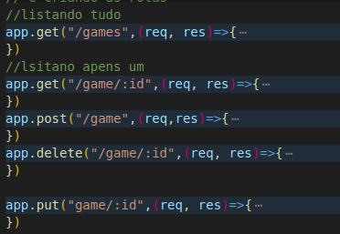

#  Api Rest

### padrão de desenvolvimento - servir dados, não guarda informações, funciona corretamente, deve ter rotas
### api restfull - quando seguimos todos os padrões
## introdução a api Rest com Nodejs
### protocolo http - get, post, put, patch, delete
### status code - 200, 400, 404
### webservices - api que funciona com protocolo http

###  express - para contruir apis
### body-parser -

## axios - para consumir a api  rest

## crud completo com api rest 

